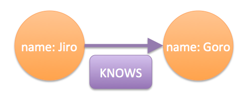
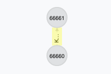
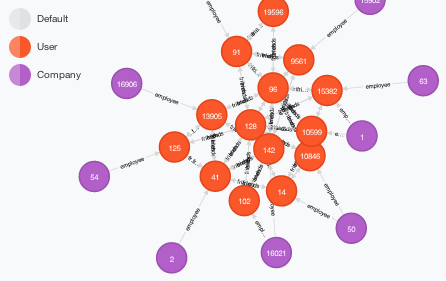

こんにちは！Wantedlyで12月中にインターンシップをしていた後藤です．
今回，業務の一環としてグラフDBであるNeo4jを1日触ってみたので，それに関してつらつら書いてみたいと思います．

## Neo4jって？

Neo4jはグラフDB（データの構造が全てグラフ構造で表されるDB）の1つです．
Javaで実装されており，オープンソースとして公開・開発が進められています．

[Neo4j公式](http://www.neo4j.org/)

グラフDBの位置付け，及びその性質に関しては次の記事が分かりやすいでしょうか．
SQLかNoSQLかという分類だと勿論NoSQLに分類されます．が，Key-Value型やドキュメント指向のものとはまた異なります．

[InfoQ グラフデータベース、NOSQL、Neo4j](http://www.infoq.com/jp/articles/graph-nosql-neo4j)

RDBやKey-Value型のDBなど，他のタイプのDBとの比較については公式マニュアルに簡単にまとめられています．

[2.2. Comparing Database Models](http://docs.neo4j.org/chunked/milestone/tutorial-comparing-models.html)


### 導入

インストールに関してはMacであればhomebrewで最新版(2.0)がインストール可能です．

```bash
$ brew install neo4j
```

あとは

```bash
$ neo4j start
```

で起動できます．起動後は[http://localhost:7474/](http://localhost:7474/)でWebインターフェイスが利用でき，そこからクエリを打ち込んだり，データをビジュアライズしたりが可能です．

### 基本

Neo4jに存在する概念は基本的に次の3つです．

- ノード
- リレーション
- プロパティ

**ノード**が個々のレコードを，**リレーション**がノードとノードの関係を表し，更に各ノード，リレーションに何らかの属性を**プロパティ**がkey-valueの形で与えます．

また，Version2.0からは新たに**ラベル**という概念も追加されました．
ラベルは"ノードをグルーピングする手段"と説明されています．

クエリは**トラバーサル(traversal)**(=ノードからノードへナビゲートする形)で投げることになります．
(traversalは横切る，とかあちこち動く，とかそういった意味で，グラフ構造の分野ではよく使われる単語みたいですね，）

これにより，例えば"◯◯さんの友達の友達を探す"のようなクエリを簡潔に与え，また高速に結果を得ることができる，というのが特徴のようです．

## Cypher

じゃあ前述のクエリは実際にはどうやって投げるの，という話ですが，**Cypher**を利用すればこれは簡単にできます．
CypherはNeo4jでデータを取得するのに利用される問い合わせ言語です．条件としてクエリの複雑な構造を指定することも可能で，特に読む用に特化されているとのことです．

[簡単なチュートリアル](http://www.neo4j.org/learn/cypher)が公式にありますが，ローカルで起動したNeo4jのWebインターフェイスにもチュートリアルがあり，個人的にはそちらの方が分かりやすかったです．

### ノードを生成する

さて，実際にCypherを少し触ってみましょう．ノードを作るには`CREATE`を使います．

    CREATE ({ name: "Taro", from: "Japan" })

Cypherではノードを丸括弧`()`で表し，プロパティを波括弧`{}`で与えます．
この例ではキーとしてname, from，その値としてTaro, Japanを持ったノードを生成していることになります．
次の例では更にこのノードに対しPersonというラベルを与えています．

    CREATE (ee:Person { name: "Garo", from: "Japan" })

``ee``はこのノードに対する変数名です．これはこのようにラベルを与えたり，次のようにリレーションを与えるために必要になります．

    CREATE (ee { name: "Jiro" }), (ir { name: "Goro"}), (ee)-[:KNOWS]->(ir)

リレーションは角括弧`[]`で表します．これで，nameというキーの値としてJiro, Goroというプロパティを持つ2つのノードを生成し，JiroがGoroに対し`KNOWS`（知っている）というリレーションを持つ，という構造ができます．図にするとこんな感じですね．



注意点として，`CREATE`では有向の関係性しか作れません．例えばfriends（友達）のような両方向の関係性の場合，両方を指定する必要があるようです．

    CREATE (ee { name: "Jiro" }), (ir { name: "Goro"}), (ee)-[:KNOWS]->(ir), (ir)-[:KNOWS]->(ee)

実際にはリレーションにもプロパティを持たせることが出来ます．例えば上の例であれば，"JiroがGoroを2011年から知っている"という関係性も簡単に表現できます．

(ちなみに変数名は公式のチュートリアルを真似ているだけなのですが...どうしてeeやらirやらなんだろう？)

### ノードを探す

さて，生成されたノードを探すには`MATCH`を利用します．

    MATCH (ee:Person) WHERE ee.name = "Taro" RETURN ee;

`MATCH`の後にパターンを指定し，これを変数eeに格納しています．更にSQLと同様`WHERE`句で条件指定が出来ます．

次の例では，ノードに対するリレーションも指定しています．

    MATCH (ee)-[:KNOWS]-(friends) WHERE ee.name = "Goro" RETURN ee, friends;

他のノードに対して`KNOWS`というリレーションを持っているノードをパターンマッチで探し，それらのノードを返していることになります．`MATCH`では`CREATE`と違い，無向の関係性でも探せるようです．(勿論有向でも指定できます．）
ちなみに用意されてるWebインターフェイスでこれらの結果を視覚化してくれます．

[](images/2014-01-02/match_vis1.png)

ちょっとこれだけだと寂しいですが...もう少しデータ増やすとこんな風になります．色がついてるノードはラベルが振られているものですね．

[](images/2014-01-02/match_vis2.png)

さて，こういった基本があった上で，複雑な関係性も簡単に表現できます．
例えば"Hogeの友達の友達"を探すクエリは次のように書くことができます．

    MATCH (ee {name: "Hoge"} )-[:friends]
    ->(friend)-[:friends]
    ->(fof)  
    RETURN fof

"Hogeの友達の友達が勤めている会社"も次のように探せます．

    MATCH (ee {name: "Hoge"})-[:friends]
    ->(friend)-[:friends]
    ->(fof)<-[:employee]-(company) 
    RETURN company

慣れると割と視覚的にも分かりやすいです．

## Neography

さて，Cypherだけではなく，Neo4jにはRESTライクなAPIも用意されています．
このAPIを利用するためのラッパーもいくつかの言語で実装されており，例えばRubyでは[Neography](https://github.com/maxdemarzi/neography)というgemがあります．NeographyはNeo4jの最新バージョンである2.0に現時点（2013年12月）で対応しており，メンテナンスもされているようです．ちなみに公式の[neo4j.rb](https://github.com/andreasronge/neo4j)もあるのですが，こちらはまだ最新版には対応していないようです．（開発が止まっている？）

Neographyに関しては日本語でまとめてくれている方も既にいらっしゃいます．

[Qiita: rubyからグラフデータベースneo4jを利用する](http://qiita.com/k-shogo/items/fce39fd5fe6c474586a7)

折角なので上でCypherで実行したものをNeographyでやってみます．

```ruby
# Neography::Restのインスタンスを生成
@neo = Neography::Rest.new

# CREATE ({ name: "Taro", from: "Japan" })
node1 = Neography::Node.create(name:"Taro", from: "Japan")
print node1 # => #<Neography::Node name="Taro", from="Japan">

# CREATE (ee:Person { name: "Garo", from: "Japan" })
node2 = Neography::Node.create(name:"Garo", from: "Japan")
@neo.add_label(node2, "Person")

# CREATE (ee { name: "Jiro" }), (ir { name: "Goro"}), (ee)-[:KNOWS]->(ir)
node3 = Neography::Node.create(name:"Jiro", from: "Japan")
node4 = Neography::Node.create(name:"Goro", from: "Japan")
node3.outgoing(:KNOWS) << node4

# CREATE (ee { name: "Jiro" }), (ir { name: "Goro"}), 
# (ee)-[:KNOWS]->(ir), (ir)-[:KNOWS]->(ee)
@neo.create_relationship("KNOWS", node3, node4)
```

先ほどのQiitaの記事にもありますが，`@neo`を利用した場合はAPIを叩いた際の結果がハッシュとしてそのまま返ってきて扱いにくい場合もあるので，ノードを扱う際は`Neography::Node`オブジェクトが返ってくるようなインターフェイスを利用した方が良さそうです．

さて，MATCHはどうなるでしょうか．特定のノードを見つけたい場合，あらかじめそのノードがインデックスに追加されている必要があります．

```ruby
index = @neo.create_node_index("people", "fulltext")
node5 = Neography::Node.create("name" => "Taro") 
node5.add_to_index(index, "name", node5.name)
```

この状況で，次のようにすればnameがTaroのノードを見つけることが出来ます．

```ruby
# MATCH (ee) WHERE ee.name = "Taro" RETURN ee;
node6 = Neography::Node.find(index, "name", "Taro")
print node6 # => #<Neography::Node name="Taro">
```

ちなみに検索にはデフォルトでApache Luceneのエンジンが利用されます．ということで与えるクエリのパターンは以下を参考にすると良いかと思います．

[Apache Lucene - Query Parse Syntax -](http://lucene.apache.org/core/2_9_4/queryparsersyntax.html)

データが入っていれば，"Taroの友達"も次のように探せます．

```ruby
print node6.outgoing(:friends).map {|n| n.name} # => name of friend(s)
```

"友達の友達"も次のように探せます．`depth`のみの指定だと深さ1のものも取ってきてしまうので`filter`が必要みたいですね．

```ruby
node6.outgoing(:friends)
.depth(2)
.uniqueness(:nodeglobal)
.filter("position.length() == 2;")
.map {|n| n}
```

## まとめ

本記事ではグラフDBの1つであるNeo4jを実際に触ってみて，その内容を簡単に紹介しました．日本語の解説記事はまだ少ないですが，インターフェイス自体は全体的に割と取っ付き易かったです．

手元で簡単に"友達の友達を探す"というクエリに対しての速度を計測してみたのですが，そこまで劇的に速い，という訳でもなさそうでした．
ただ"友達の友達の更にその友達"とか，グラフ構造で何層も進む必要があるような関係を頻繁に取得する必要がある際には選択肢に入るのかもしれません．
利用される際は[公式のパフォーマンスガイド](http://docs.neo4j.org/chunked/milestone/performance-guide.html)も参考にされると良いのかなと．

ここまで書いて，キャッシュの仕組みとかどうなってるのかなあ...と色々ググってたらエンタープライズ版（有料）だと**High Perfomance Cache**ってありますね．_Queries can run up to 10x faster_って...([参考](http://www.neo4j.org/learn/licensing))．比較するならこっちの方が良いのかな．

まあでもDBにも色々と選択肢が増えてきて楽しいですね．RDBを少し触ったことがある程度だったので勉強になりました．


