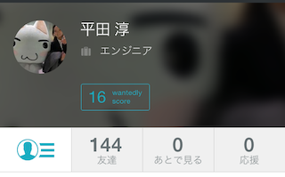
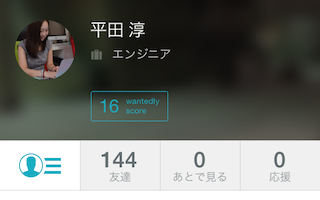

こんにちは！
今回、Wantedlyのインターンに参加させてもらった大学4年生のじゅんです。 
普段、life is tech!でメンターしていて、[未踏クリエータ](http://tech-tokyo.com/?p=7470)もやっています。

前々からWantedlyがどんな会社なのか気になっていて、 
今回、2/17から2/21までの5日間のインターンが実現しました^^

## インターンでやったこと
初日はまずWantedlyがどんな会社なのか、どんな人たちが働いているのか、知るところから始まりました。 
この時間だけで、Wantedlyのチームの雰囲気の良さとか、凄さが伝わってきました。

その後、インターンで具体的に何をするかの目標をたてました。 
私は、普段からiOSアプリを作ることが多いので、 
WantedlyのiOSアプリを開発している れいさん と相談して、 WantedlyのiOSアプリのプロフィール画面のアイコンと背景を変えるところを実装することに決めました。

＜変更前(アイコンも背景もfacebookの画像)＞ 

＜変更後＞ 

具体的には、サーバーからS3に画像をアップロードするためのkey等を取ってきて.... 
それを使って、S3に画像を送って.... 
サーバーにS3のURLを送る... といったことをしました。

##バリィさんエンジニア

[バリィさん http://www.barysan.net/ より]

開発をはじめて、さあコードを書こう!と思ったのですが、そこでいろんな事に気づきます。 
ちょっと書き足そうとすると、関連しているクラスとかフレームワークをいくつか見つけて(-ω-) 
あわあわしながら各クラスに目を通して少しずつ進めていきました。

(いままで私は、ほぼ全部ViewControllerクラスに書いていたので、ここですでに自分の経験の少なさを感じました>_<　storyboadを使うのも初めてでした。。)

そんな感じで開発を進めていたら、、 
私のデスクトップの背景がバリィさんだったのもあって、 
私の右隣に座って、めっちゃコード書いている相川さんに、 
　　「バリィさんエンジニア」 
と呼ばれるようになりました笑 
ちなみに、「バリィさんエンジニア」が進化すると、「"バリバリの"エンジニア」になれるみたいです。

##バリィさんエンジニアのまとめ
今回のインターンで、Wantedlyの凄いエンジニアの方々から、たくさんの事を教えて頂きました！ 
自分がこれから自分がどんな事を勉強して、今後どんなことが出来るようになりたいかの目標が出来た気がします。

こんな素敵なインターンの機会を作って頂いたWantedlyのみなさんありがとうございました！ 
まだまだバリィさんエンジニアですが、進化できるように頑張りたいと思います^^ 
これからもよろしくお願いします！ 

##ちなみに

今回改善していたiOSアプリは[これ](https://itunes.apple.com/us/app/wantedly-kokoroodoru-shi-shigakitto/id804727886?l=ja&ls=1)です。
